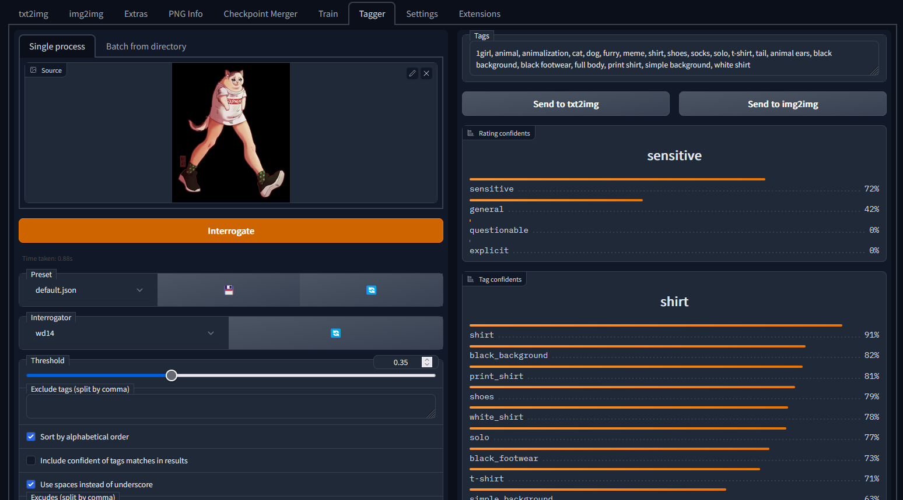

[Automatic1111 웹UI](https://github.com/AUTOMATIC1111/stable-diffusion-webui)를 위한 태깅(라벨링) 확장 기능
---
DeepDanbooru 와 같은 모델을 통해 단일 또는 여러 이미지로부터 부루에서 사용하는 태그를 알아냅니다.

[You don't know how to read Korean? Read it in English here!](README.md)

## 들어가기 앞서
모델과 대부분의 코드는 제가 만들지 않았고 [DeepDanbooru](https://github.com/KichangKim/DeepDanbooru) 와 MrSmillingWolf 의 태거에서 가져왔습니다.

## 설치하기
1. *확장기능* -> *URL로부터 확장기능 설치* -> 이 레포지토리 주소 입력 -> *설치*
   - 또는 이 레포지토리를 `extensions/` 디렉터리 내에 클론합니다.
      ```sh
      $ git clone https://github.com/toriato/stable-diffusion-webui-wd14-tagger.git extensions/tagger
      ```

1. 모델 추가하기
   - #### *DeepDanbooru*
      1. 다양한 모델 파일은 아래 주소에서 찾을 수 있습니다.
         - [DeepDanbooru model](https://github.com/KichangKim/DeepDanbooru/releases)
         - [e621 model by 🐾Zack🐾#1984](https://discord.gg/BDFpq9Yb7K)
            *(NSFW 주의!)*

      1. 모델과 설정 파일이 포함된 프로젝트 폴더를 `models/deepdanbooru` 경로로 옮깁니다.

      1. 파일 구조는 다음과 같습니다:
         ```
         models/
         └╴deepdanbooru/
           ├╴deepdanbooru-v3-20211112-sgd-e28/
           │ ├╴project.json
           │ └╴...
           │
           ├╴deepdanbooru-v4-20200814-sgd-e30/
           │ ├╴project.json
           │ └╴...
           │
           ├╴e621-v3-20221117-sgd-e32/
           │ ├╴project.json
           │ └╴...
           │
           ...
         ```
    
   - #### *MrSmilingWolf's model (a.k.a. Waifu Diffusion 1.4 tagger)*
      모델과 추가 학습에 관해선 원작자인 MrSmilingWolf#5991 에게 문의해주세요.
      
      MrSmilingWolf 의 말:

      > Based on validation score I'd say this is pretty much production grade.
      >
      > I've launched a longer training run (50 epochs, ETA: 9 days), mainly to check how much more can be squeezed out of it, but I'm fairly confident this can be plugged into a real inference pipeline already.
      >
      > I'm also finetuning the ConvNext network, but so far ViT has always coped better with less popular classes, so I'm edging my bets on this one.
      OTOH, ensembling seems to give a decent boost in validation metrics, so if we ever want to do that, I'll be ready."
      1. 압축된 모델 파일을 받습니다.
         1. [SD Training Labs](https://discord.gg/zUDeSwMf2k) 디스코드 서버에 참가합니다
         1. [이 메세지](https://discord.com/channels/1038249716149928046/1038249717001359402/1041160494150594671)에서 mega.nz 주소를 찾을 수 있습니다

      1. 클론된 레포지토리 속에 압축을 해제합니다.

      1. 파일 구조는 다음과 같습니다:
         ```
         extensions/
         └╴wd14-tagger/
           ├╴2022_0000_0899_6549/
           │ └╴selected_tags.csv
           │
           ├╴networks/
           │ └╴ViTB16_11_03_2022_07h05m53s/
           │   └╴ ...
           │
           ├╴scripts/
           │ └╴tagger.py
           │
           ...
         ```
1. 웹UI 를 시작하거나 재시작합니다.
   - 또는 *Interrogator* 드롭다운 상자 우측에 있는 새로고침 버튼을 누릅니다.


## 스크린샷


Artwork made by [hecattaart](https://vk.com/hecattaart?w=wall-89063929_3767)

## 저작권

빌려온 코드(예: `dbimutils.py`)를 제외하고 모두 Public domain 